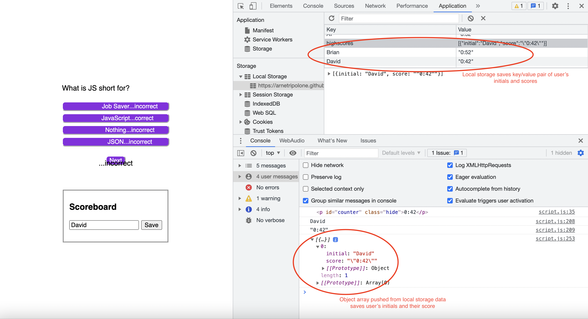

### Link To Deployed Site 
https://arnetripolone.github.io/coding_quiz/

### Resubmission Improvements
- Scoreboard displays with user input at end of quiz
- Timer ends when user clicks stop the clock
- Local storage saves user's input (initials), and registers their score as per the timer
- Improved overall functionality and array of questions
- Bug fixes (i.e., spelling and display errors)

### Description
This repository contains a coding quiz in a multiple choice response format. The Web Dev Simplified video 'Build A Quiz App With JavaScript' was helpful in formulating the Java Script (https://www.youtube.com/watch?v=riDzcEQbX6k). A timer function was sourced from this repository: https://gist.github.com/adhithyan15/4350689 . James Q Quick's video 'Build a Quiz App (4) - Display Feedback for Correct/Incorrect Answers' assisted with applying classes to correct vs wrong answers (https://www.youtube.com/watch?v=_LYxkClHnV0).

### GIF 

### Screenshot of Inspector

